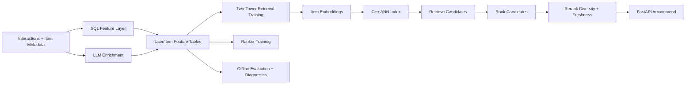

# SignalRank

**Industrial-grade retrieval and ranking framework with Python ML pipelines, SQL feature workflows, and C++-accelerated retrieval primitives.**

SignalRank is a portfolio-quality, production-style repository for large-scale personalized recommendation (content / ads / marketplace style). It demonstrates a coherent multi-stage system with explicit boundaries between data modeling, retrieval, ranking, reranking, evaluation, and online serving.

---

## Why this project exists

Most recommendation projects are either model-only demos or architecture-only diagrams. SignalRank is intentionally end-to-end:

- **Python** handles model training, orchestration, and online API composition.
- **SQL** defines reproducible feature tables, training datasets, diagnostics, and offline evaluation slices.
- **C++** accelerates latency-critical top-k retrieval in the online path (full-index and filtered subset retrieval).

These are first-class components, not decorative add-ons.

---

## System architecture



Pipeline stages:
1. Candidate generation (interaction priors by surface)
2. ANN retrieval (embedding similarity via C++ accelerated top-k)
3. Ranking (feature-aware scoring)
4. Reranking (diversity policy)
5. Evaluation (AUC, log loss, NDCG@K, MRR@K + SQL slices)
6. Serving (`/retrieve`, `/rank`, `/recommend`)

---

## Repository structure

```text
SignalRank/
├── cpp/                     # C++ pybind11 retrieval kernels
├── src/signalrank/
│   ├── retrieval/           # two-tower + candidate generation + ANN wrapper
│   ├── ranking/             # ranker model + online scoring logic
│   ├── rerank/              # policy layer (diversity/freshness)
│   ├── llm/                 # semantic tag / taxonomy / embedding enrichment
│   ├── orchestration/       # end-to-end pipeline assembly
│   ├── serving/             # FastAPI endpoints + schemas
│   └── evaluation/          # metrics
├── sql/
│   ├── features/            # user/item feature tables
│   ├── training/            # model training datasets
│   ├── evaluation/          # scored eval tables and metric slices
│   └── diagnostics/         # sparsity/distribution/coverage checks
├── scripts/                 # local run entrypoints
├── docs/                    # architecture, serving, evaluation, development
├── tests/                   # smoke + metric/integration tests
└── data/sample/             # local demo data
```

---

## What is implemented vs simplified

Implemented:
- Two-tower retrieval training scaffold (PyTorch).
- Candidate generation by interaction priors.
- ANN retrieval API with C++ full-index and subset top-k.
- Ranking stage and policy reranking.
- SQL features/training/evaluation/diagnostics that connect coherently.
- FastAPI online endpoints for stage-level and end-to-end inference.

Simplified (for local reproducibility):
- Small local sample dataset.
- Lightweight deterministic online scoring proxy instead of full model-serving runtime.
- Dense vector brute-force top-k kernel (C++) rather than full ANN graph index.

---

## Local setup

```bash
python -m venv .venv
source .venv/bin/activate
pip install -e .[dev]
```

Build note: `pip install -e .` compiles the pybind11 extension (`signalrank_cpp`).

---

## End-to-end local demo

1) Build SQL features + training/eval tables:

```bash
python scripts/run_feature_sql.py
```

2) Train retrieval model:

```bash
python scripts/train_retrieval.py
```

3) Train ranking model:

```bash
python scripts/train_ranker.py
```

4) Run offline evaluation:

```bash
python scripts/evaluate_offline.py
```

5) Start API:

```bash
python scripts/run_server.py
```

6) Call full pipeline endpoint:

```bash
curl -X POST http://127.0.0.1:8000/recommend \
  -H 'Content-Type: application/json' \
  -d '{"user_id": 101, "context": {"hour": 18, "surface": "home", "country": "US"}, "top_k": 5}'
```

---

## Why C++ is necessary here

The retrieval path must repeatedly compute vector similarity + top-k under strict latency budgets. Doing this in Python loops creates overhead from interpreter dispatch and object allocation.

`cpp/ann_index.cpp` provides native implementations for:
- `top_k(query, k)` for full-index retrieval
- `top_k_subset(query, candidate_ids, k)` for filtered retrieval after candidate generation

Python orchestrates pipeline logic; C++ handles score-and-select kernels.

---

## Metrics and diagnostics

Python metrics:
- AUC
- Log Loss
- NDCG@K
- MRR@K

SQL diagnostics:
- Slice metrics by surface/country
- Null-rate and quantiles for key features
- Category coverage table for data health checks

See:
- `docs/evaluation.md`
- `sql/evaluation/`
- `sql/diagnostics/`

---

## Documentation

- `docs/architecture.md` — system rationale and data flow
- `docs/serving.md` — API contracts and latency notes
- `docs/evaluation.md` — metric design and SQL validation
- `docs/development.md` — contributor/developer workflow
- `docs/audit_final_pass.md` — final-pass audit and upgrade summary

---

## Future improvements

- Replace brute-force dense retrieval kernel with HNSW/IVF index.
- Add model registry and online model version routing.
- Add calibrated ranker outputs and slice-level calibration dashboards.
- Add streaming feature freshness checks with event-time watermarks.

---

## License

MIT
