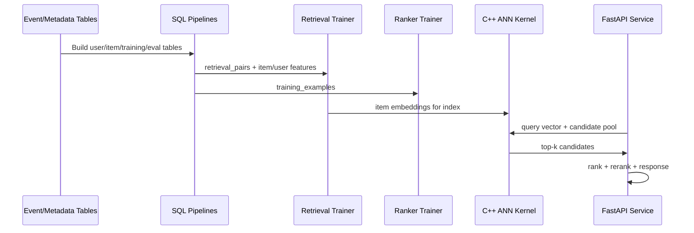

# SignalRank Architecture

## Design objective
Deliver a believable production-style retrieval/ranking stack where each layer has a clear contract:
- SQL for reproducible features and evaluation datasets.
- Python for model training, orchestration, and API composition.
- C++ for low-latency score-and-select kernels.

## Data flow

## Stage contracts

1. **Candidate generation**
   - Input: recent interactions by surface.
   - Output: bounded candidate item IDs.

2. **Retrieval**
   - Input: user embedding + candidate pool.
   - Output: top-k by embedding similarity (`retrieval_score`).

3. **Ranking**
   - Input: retrieved candidates + user/context/item priors.
   - Output: `rank_score`.

4. **Reranking**
   - Input: ranked candidates.
   - Output: policy-adjusted `final_score` with diversity guardrails.

5. **Evaluation**
   - SQL-generated scored examples + Python metric library.

## Why C++ is on the critical path
The high-frequency operation in retrieval is vector dot-product + top-k select. This is moved to `signalrank_cpp` to avoid Python per-item overhead and reduce tail latency for online requests.
